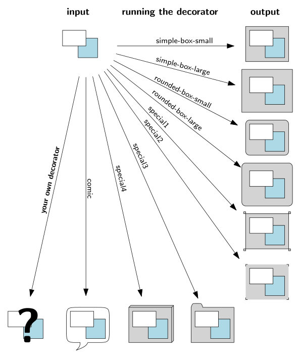

# decorator

With the decorator ipelet, you can decorate things by surrounding them
with a box-like object, e.g., boxes with round corners.  The ipelet is
flexible in the sense that you can define your own decorator objects.
The example file [decorator.ipe](decorator.ipe) illustrates the usage.

 

## Usage

Run `Ipelets -> Decorator -> decorate` to decorate the currently
selected objects.  For that to work, there must be decorator objects
(symbols with prefix "deco/") defined in your stylesheet (see the
example above).

## Creating Decorator Objects

To create your own decorator object, execute the following steps.
  1. Create a rectangle, lets call it *R*.
  2. Create path objects, that decorate *R* (usually some kind of box
     around *R*).  You can use multiple objects for the decoration.
  3. Make sure that *R* is the front most object (select *R* and press
     `Ctrl + F`).
  4. Group *R* together with the decoration (select *R* and the
     decoration and press `Ctrl + G`).
  5. Run `Ipelets -> Decorator -> create deco-object`.

Note that `Ipelets->Decorator->create deco-object` only slightly
extends `Ipelets->Symbols->create symbol` (it checks whether the
selected object can be used as decorator object and it automatically
adds the prefix `deco/`).

## Notes

Since Ipe 7.2.5, Ipe itself has a similar feature.  So you probably
also want to check that out.
