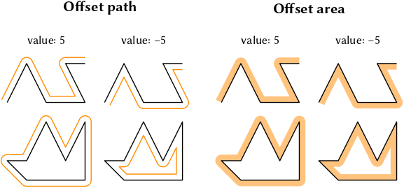

# Offset Ipelet #

This ipelet draws an offset path at a given distance to a selected
polyline or polygon.  At corners it connects consecutive segments with
arcs.  Besides the offset path you can also get the area between the
offset path and the original polyline/polygon.

## Tips and Notes ##

- If you select multiple polyliens/polygons, the offset path for each
  of them is created.  The same holds for compositions of multiple
  polylines/polygons.
- If you want an offset in the opposite direction, use negative
  numbers.
- The behavior on curves is undefined.
