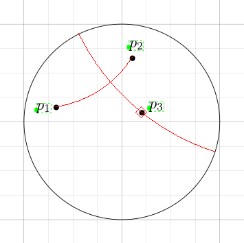
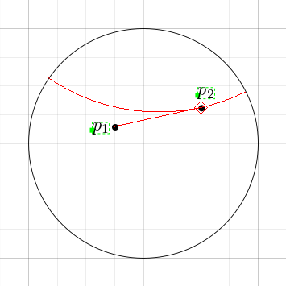

The Poincaré ipelet provides some drawing tools for drawing in the
hyperbolic plane (represented by the Poincaré disk).

# Download & Installation #

Download [poincare.lua](poincare.lua) and copy it to ~/.ipe/ipelets/
(or to some other directory for ipelets).

# Usage #

You first have to tell the ipelet where your Poincaré disk lies.  To
do so, select a circle and klick "Ipelets->Poincaré Disk Model->set
disk" or hit H, D (see [Shortcuts](#shortcuts)).

Afterwards you can use the drawing tools as you would normal ipe
tools, i.e., you can just start drawing by clicking somewhere
(preferably somewhere inside the disk).  The only difference is that
there is no nice icon in the toolbar that shows which tool is
currently selected.

# Shortcuts #

The shortcuts consist of multiple keys, always starting with an H.  To
use for example the shortcut "H, D", first press the h-key and then
the d-key.

| Shortcut   | Action                                      |
| ---------- | ------------------------------------------- |
| H, D       | set the Poincaré disk                       |
| H, Shift+P | select the line tool                        |
| H, P       | select the line segment tool                |
| H, Ctrl+P  | select the right angle tool                 |
| H, Alt+P   | select the tangent tool                     |
| H, O       | select the circle tool                      |
| H, Shift+O | select the circle tool (by center + radius) |
| H, Ctrl+O  | select the circle tool (by radius + center) |

# The Tools #

## Line Tool ##

Draw the line through two points.

## Line Segment Tool ##

Draw the line segment between two points.

## Right Angle Tool ##

 Draw a line perpendicular to
a given line.  This tool can be used in two ways.  If you click three
points, it will create a line through the third point perpendicular to
the line through the first two points.  If your second click is a
right click, it will draw a line through the second point
perpendicular to the line through the first two points.

## Tangent Tool ##

 Draw a line that is tangent to a
euclidean line through two points and contains the second point.

## Circle Tool ##

Draw a circle centered at the first point going through the second.

## Circle Tool (by Center + Radius) ##

The first point is used as center, the distance between the second and
third point is the radius.

## Circle Tool (by Radius + Center) ##

The distance between the first and second point specify the radius,
the third point us used as center.
